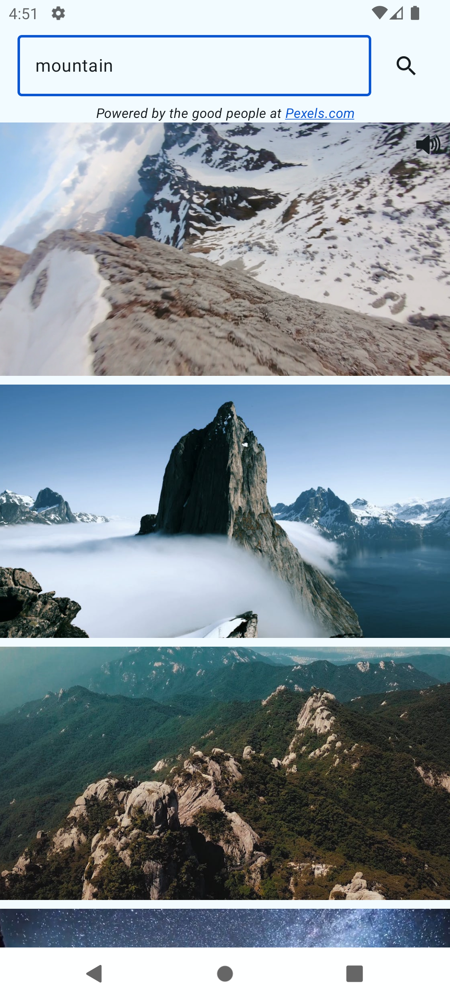

# 🎬 Android Video Player Optimization Demo

> **ExoPlayer Performance Experimentation & Optimization Showcase**

A technical demonstration app exploring advanced video playback optimization techniques using ExoPlayer and Pexels API. Built to showcase Android development skills and experiment with efficient video handling strategies.

&ensp;

## 🎯 Project Goal

Experiment with ExoPlayer configurations to find the most optimized way to play videos on Android, while demonstrating modern development practices.

## ✨ Current Features

- Video list with Pexels API integration
- ExoPlayer-based video playback
- Auto-play for top video
- Simplified MVI architecture

## 🚀 Planned Improvements

- [ ] **Dynamic ExoPlayer Configuration**: Switch between different player setups in real-time
- [ ] **Adaptive Quality Loading**: Low-quality first, then upgrade to high-quality
- [ ] **Interactive Video Selection**: Tap to play any video from the list
- [ ] **Advanced Caching**: Hybrid system using LRU, TTL, and custom threshold methods
- [ ] **User Preferences**: Save auto-play and sound settings in SharedPreferences
- [ ] **Full-Screen Mode**: Immersive video viewing experience

## 🛠️ Tech Stack

- **Language**: Kotlin
- **Architecture**: Simplified MVI
- **Media**: ExoPlayer
- **API**: Pexels.com for video content
- **Note**: Simplified error handling and architecture for demo purposes

## 🚦 Quick Start

1. **Get Pexels API Key**: [Sign up here](https://www.pexels.com/api/) for free
2. **Clone**: `git clone https://github.com/GalouM/AndroidShowingVideos.git`
3. **Add API Key**: Configure your Pexels API key in the project
4. **Run**: Open in Android Studio and build

## 🔍 Focus Areas

- **Performance**: Video loading and playback optimization
- **Memory Management**: Efficient caching and codec handling
- **User Experience**: Smooth scrolling with video content
- **Experimentation**: Testing different ExoPlayer configurations

## 🤝 Collaboration Welcome!

Looking for ideas and contributions on:
- ExoPlayer optimization techniques
- Creative caching strategies
- Performance improvements
- UX enhancements

## 📞 Connect

- **LinkedIn**: [Gaelle Minisini](https://www.linkedin.com/in/gaelleminisini)
- **Medium**: [Read my articles](https://medium.com/@galou.minisini)
- **GitHub**: Open issues or submit PRs for collaboration

---

*Demo app focused on video optimization experimentation and Android development skill showcase.*